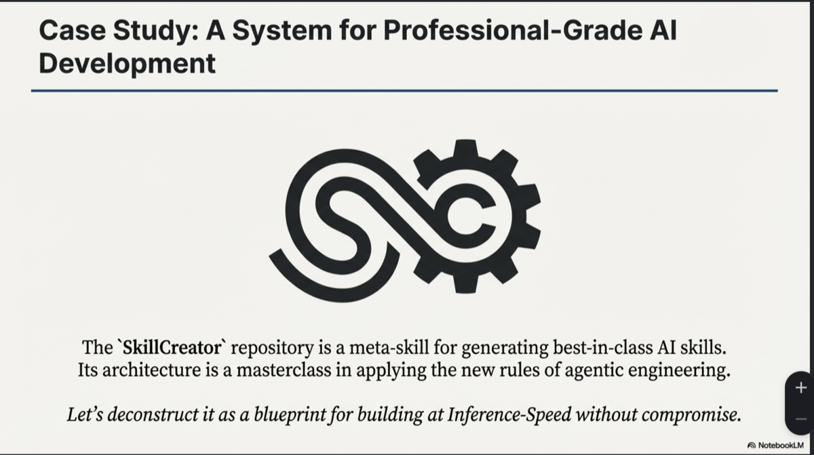
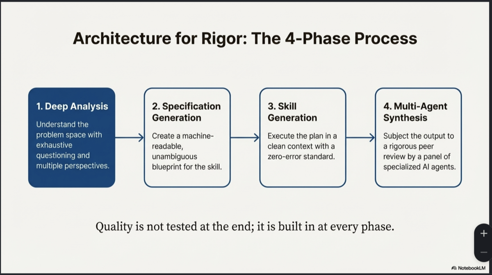
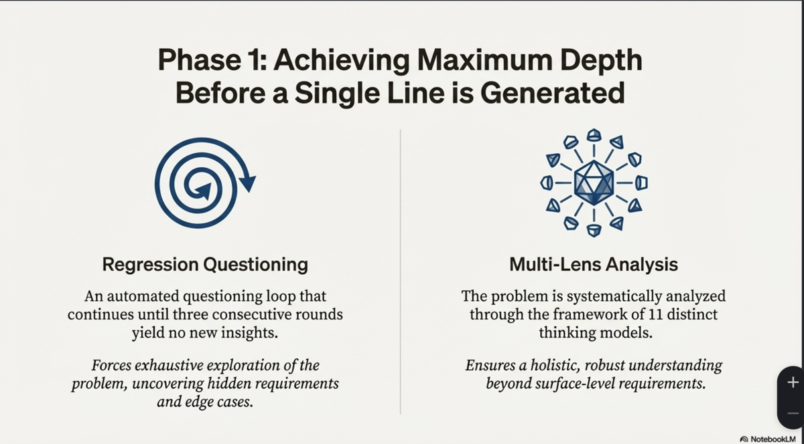
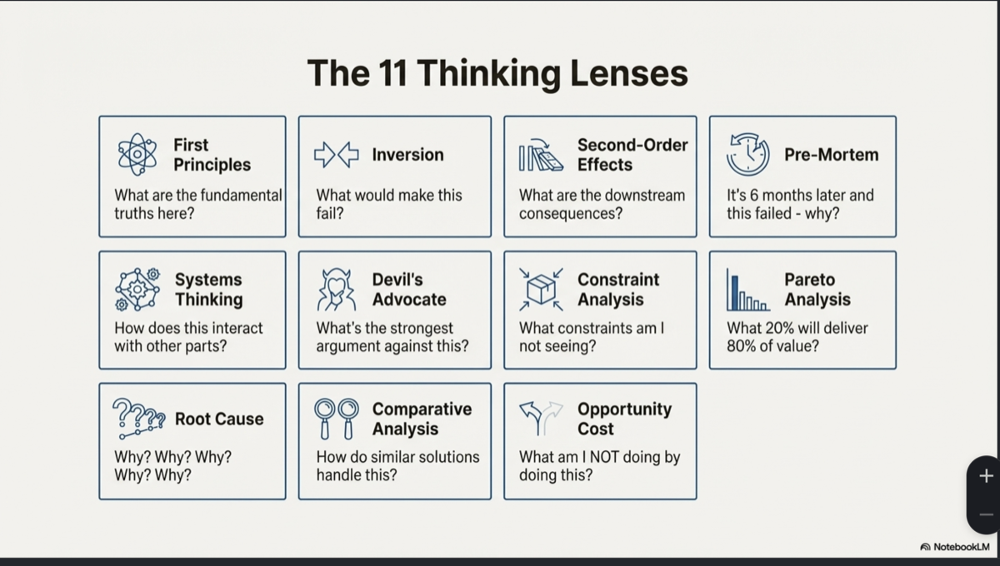
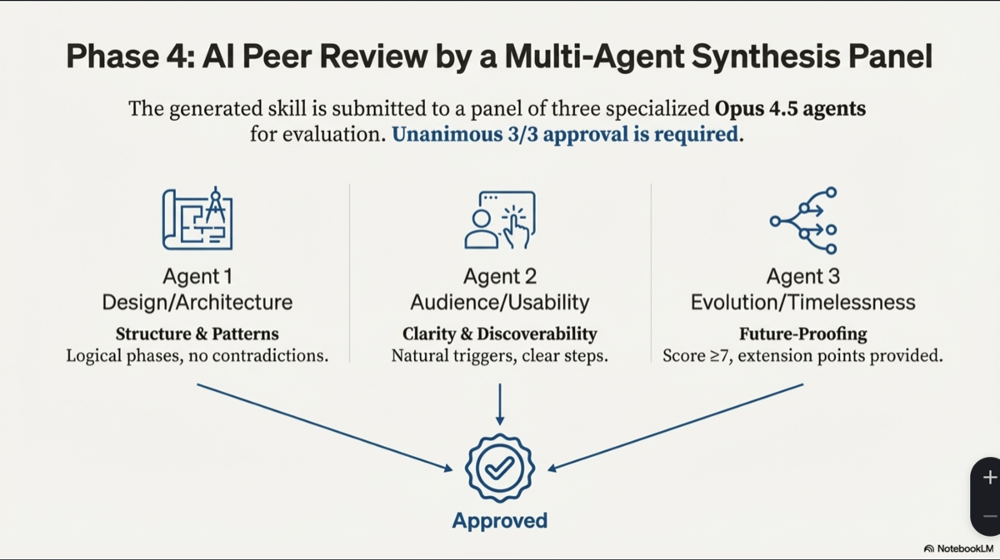
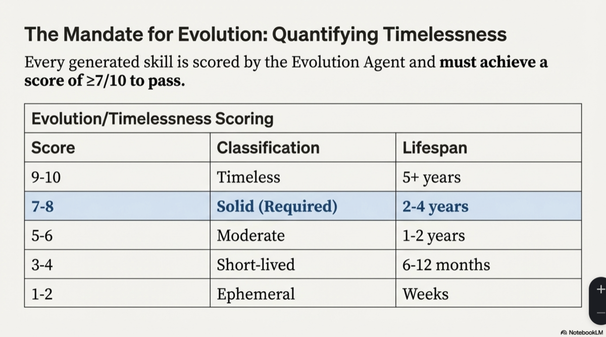
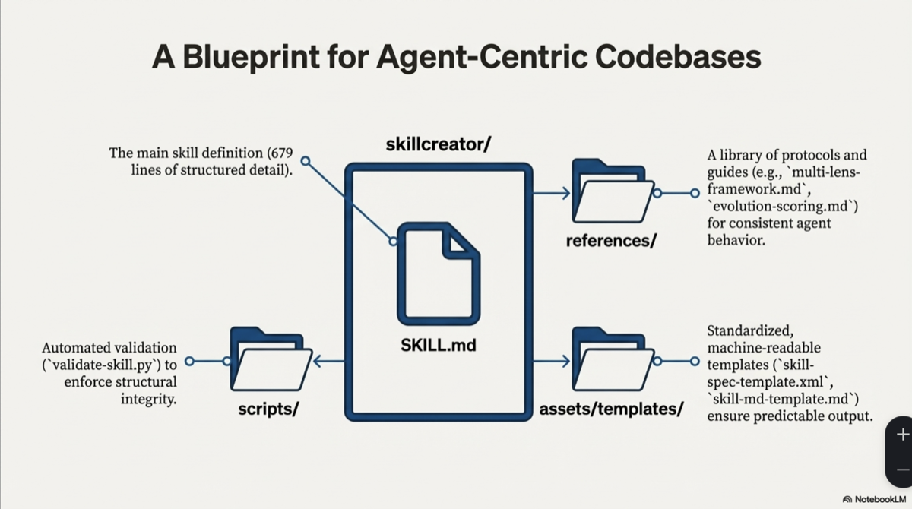
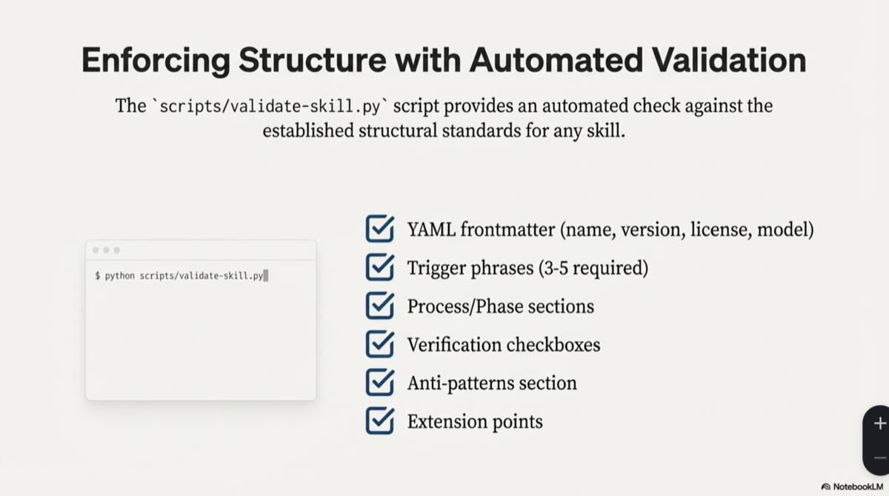
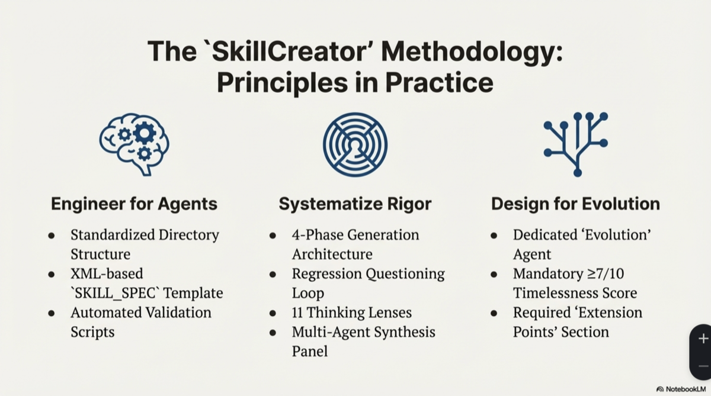

# SkillCreator v3.1

The ultimate meta-skill for generating best-in-class Claude Code skills.



## Overview

SkillCreator uses a rigorous 4-phase architecture to produce skills that are comprehensively analyzed, thoroughly specified, cleanly generated, and unanimously approved by a multi-agent synthesis panel.



**Quality is not tested at the end; it is built in at every phase.**

## Quick Start

```
SkillCreator: create a skill for automated code review
```

That's it. The skill will be created autonomously with full analysis, verification, and quality gates.

## The Methodology

### Phase 1: Deep Analysis

Achieve maximum depth before a single line is generated.



#### The 11 Thinking Lenses

Every problem is systematically analyzed through 11 distinct thinking models:



### Phase 4: Multi-Agent Synthesis

The generated skill is submitted to a panel of three specialized Opus 4.5 agents for evaluation. **Unanimous 3/3 approval is required.**



### Evolution/Timelessness Scoring

Every generated skill is scored by the Evolution Agent and must achieve a score of ≥7/10 to pass.



## A Blueprint for Agent-Centric Codebases



```
skillcreator/
├── SKILL.md                          # Main skill definition
├── README.md                         # This file
├── LICENSE                           # MIT License
├── references/
│   ├── regression-questions.md       # Question bank for deep analysis
│   ├── multi-lens-framework.md       # 11 thinking model application guide
│   ├── specification-template.md     # XML spec template documentation
│   ├── evolution-scoring.md          # Timelessness scoring rubric
│   └── synthesis-protocol.md         # Multi-agent panel protocol
├── assets/
│   ├── images/                       # Documentation images
│   └── templates/
│       ├── skill-spec-template.xml   # Structured specification template
│       └── skill-md-template.md      # Output skill markdown template
└── scripts/
    ├── validate-skill.py             # Full structural validation
    ├── quick_validate.py             # Packaging validation
    └── package_skill.py              # Create .skill distribution files
```

## Automated Validation



```bash
# Quick validation (required for packaging)
python scripts/quick_validate.py /path/to/skill/

# Full structural validation
python scripts/validate-skill.py /path/to/skill/

# Package for distribution
python scripts/package_skill.py /path/to/skill/ ./dist
```

## The SkillCreator Methodology



### Key Principles

| Principle | Implementation |
|-----------|----------------|
| **Engineer for Agents** | Standardized directory structure, XML-based templates, automated validation |
| **Systematize Rigor** | 4-phase architecture, regression questioning, 11 thinking lenses, multi-agent synthesis |
| **Design for Evolution** | Dedicated Evolution agent, mandatory ≥7/10 timelessness score, required extension points |

## Installation

Copy to your Claude Code skills directory:

```bash
cp -r skillcreator ~/.claude/skills/
```

## Usage

Invoke with natural language:
- `SkillCreator: {goal}` - Full autonomous execution
- `create skill` - Natural language activation
- `design skill for {purpose}` - Purpose-first creation
- `ultimate skill` - Emphasize maximum quality
- `skillcreator --plan-only` - Generate specification only

## Requirements

- Claude Code CLI
- Claude Opus 4.5 model access
- Python 3.8+ (for validation scripts)

## License

MIT License - see [LICENSE](LICENSE)
