# SkillCreator v3.2

The ultimate meta-skill for generating best-in-class Claude Code skills.

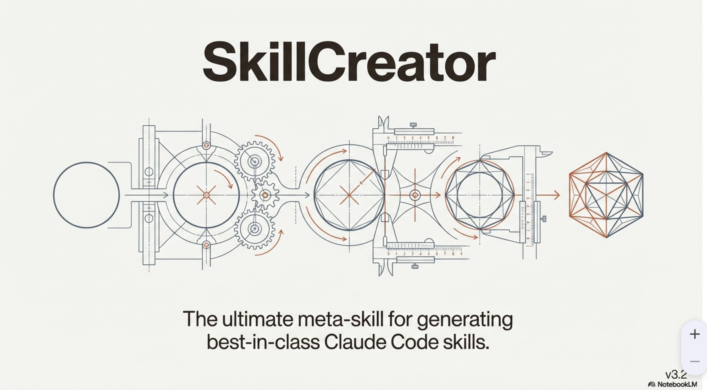

## The Problem

The challenge with AI skills is the gap between a good idea and engineered quality.

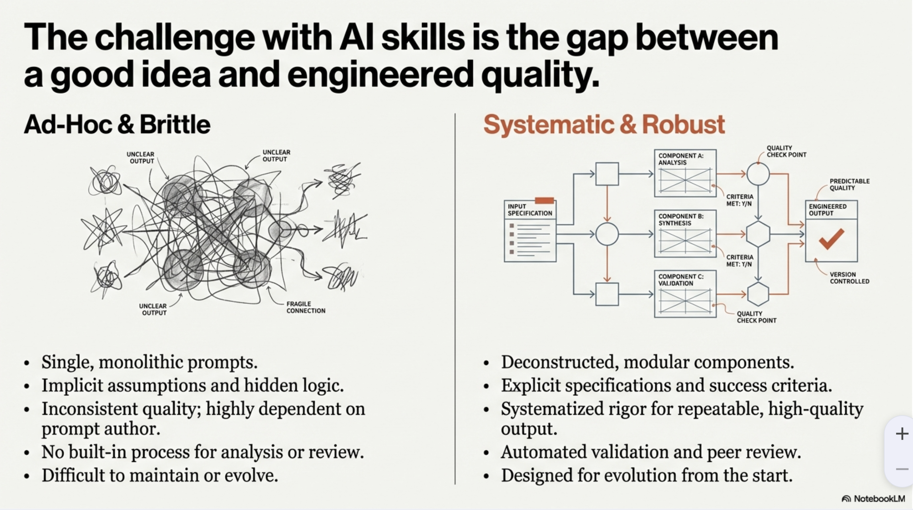

## The Solution

**Quality is not tested at the end; it is built in at every phase.**

SkillCreator implements this through a rigorous 4-phase architecture, ensuring comprehensive analysis, thorough specification, clean generation, and unanimous approval for every skill produced.

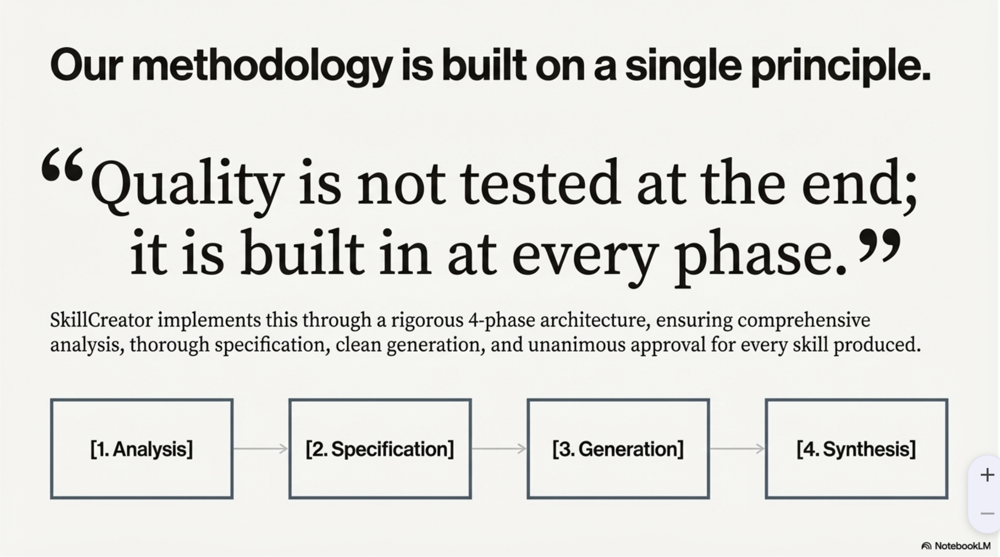

## Quick Start

```bash
# Installation
cp -r skillcreator ~/.claude/skills/

# Usage - invoke with a simple goal
SkillCreator: create a skill for automated code review
```

That's it. The system handles the entire 4-phase process autonomously.

## The Methodology

### Phase 1: Deep Analysis

Achieve maximum depth before a single line is generated.

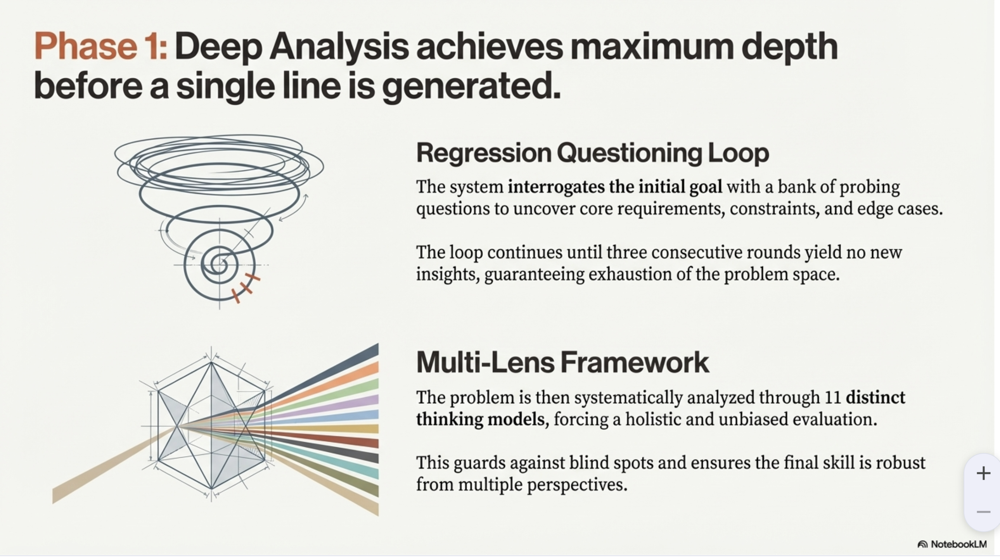

#### The 11 Thinking Lenses

Every problem is systematically analyzed through 11 distinct thinking models, forcing a holistic and unbiased evaluation:


### Phases 2 & 3: Specification and Generation

Deep analysis is translated into a flawless build.

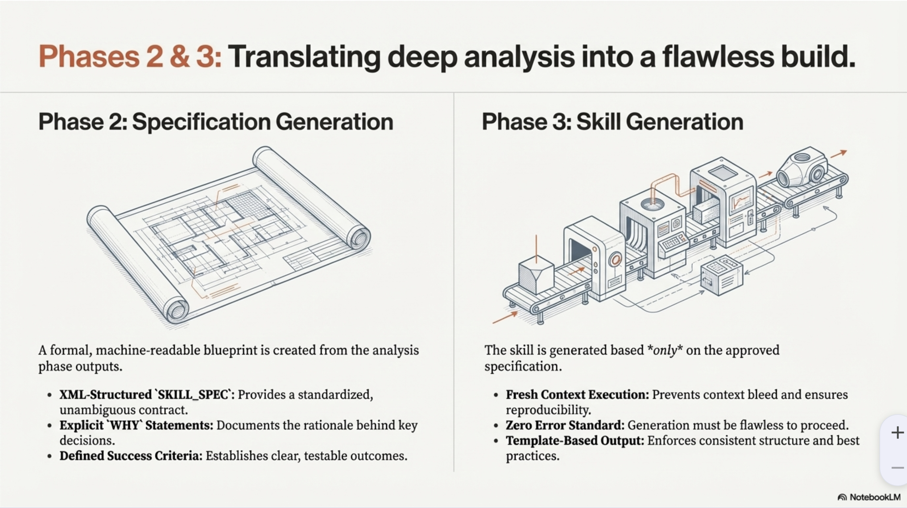

### Phase 4: Multi-Agent Synthesis

The generated skill is submitted to a panel of specialized Opus 4.5 agents for evaluation. **Unanimous approval is required.**

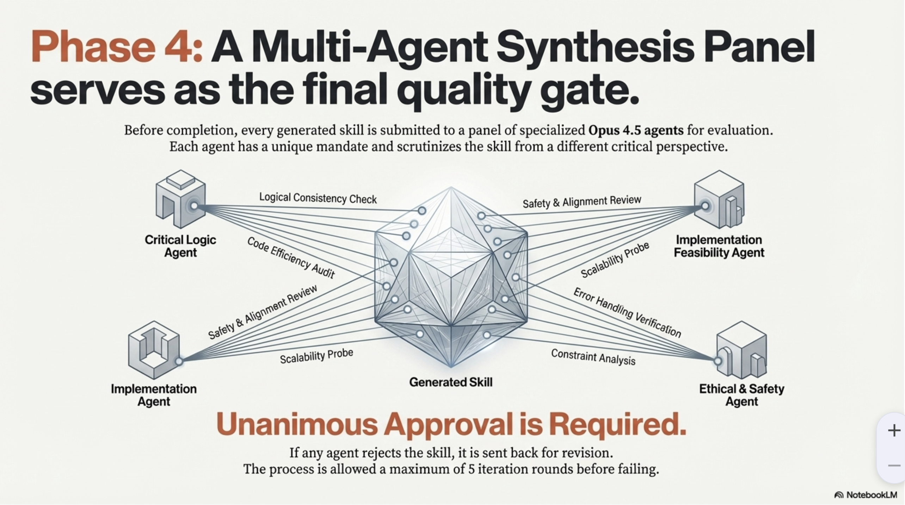

Each agent evaluates the skill against rigorous, specialized criteria:

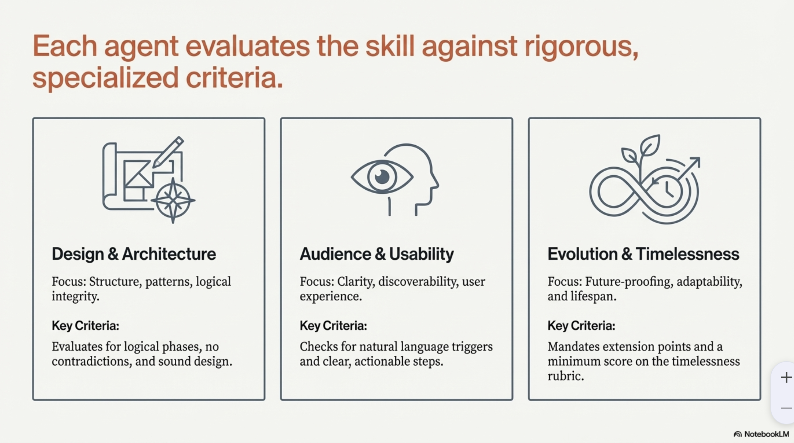

### The Evolution Mandate

Skills are designed for a multi-year lifespan. The Evolution/Timelessness Agent scores every skill, and it **must achieve ≥7/10 to pass**.

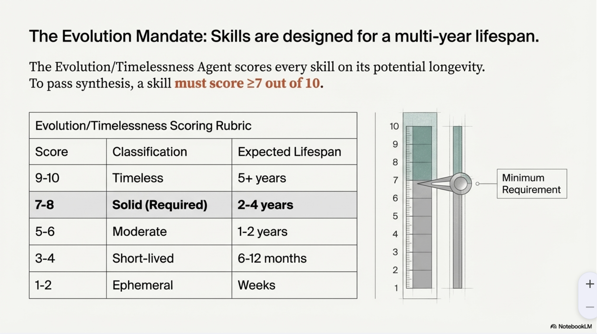

## What's New in v3.2

SkillCreator 3.2 introduces a comprehensive script integration framework, enabling fully agentic skills.

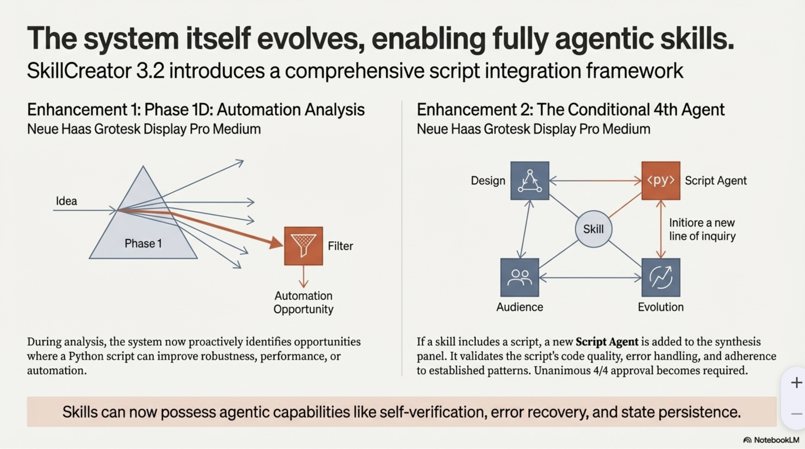

**Key Additions:**
- **Phase 1D: Automation Analysis** - Proactively identifies opportunities for Python scripts
- **Conditional 4th Agent** - Script Agent validates code quality when scripts are present
- Skills can now possess agentic capabilities like self-verification, error recovery, and state persistence

## Core Principles

The SkillCreator methodology is guided by three core principles:


| Principle | Implementation |
|-----------|----------------|
| **Engineer for Agents** | Standardized directory structure, XML-based templates, automated validation |
| **Systematize Rigor** | 4-phase architecture, regression questioning, 11 thinking lenses, multi-agent synthesis |
| **Design for Evolution** | Dedicated Evolution agent, mandatory ≥7/10 timelessness score, required extension points |

## Directory Structure

A blueprint for agent-centric codebases:

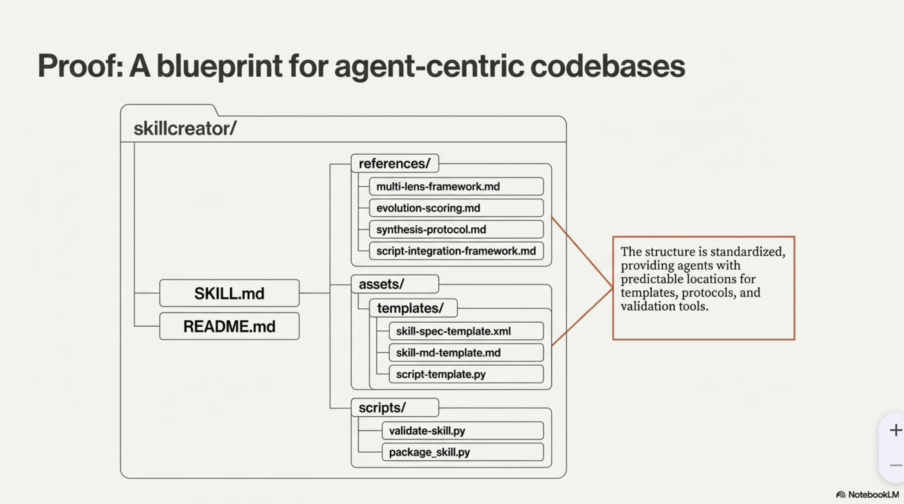

```
skillcreator/
├── SKILL.md                          # Main skill definition
├── README.md                         # This file
├── LICENSE                           # MIT License
├── references/
│   ├── regression-questions.md       # Question bank for deep analysis
│   ├── multi-lens-framework.md       # 11 thinking model application guide
│   ├── specification-template.md     # XML spec template documentation
│   ├── evolution-scoring.md          # Timelessness scoring rubric
│   ├── synthesis-protocol.md         # Multi-agent panel protocol
│   ├── script-integration-framework.md  # When/how to create scripts (NEW)
│   └── script-patterns-catalog.md    # Standard Python patterns (NEW)
├── assets/
│   ├── images/                       # Documentation images
│   └── templates/
│       ├── skill-spec-template.xml   # Structured specification template
│       ├── skill-md-template.md      # Output skill markdown template
│       └── script-template.py        # Python script starter (NEW)
└── scripts/
    ├── validate-skill.py             # Full structural validation
    ├── quick_validate.py             # Packaging validation
    └── package_skill.py              # Create .skill distribution files
```

## Installation & Usage

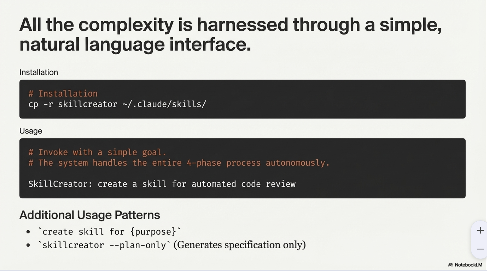

```bash
# Installation
cp -r skillcreator ~/.claude/skills/
```

**Usage Patterns:**
- `SkillCreator: {goal}` - Full autonomous execution
- `create skill for {purpose}` - Natural language activation
- `skillcreator --plan-only` - Generates specification only

## Automated Validation

Quality is verified with automated validation scripts.

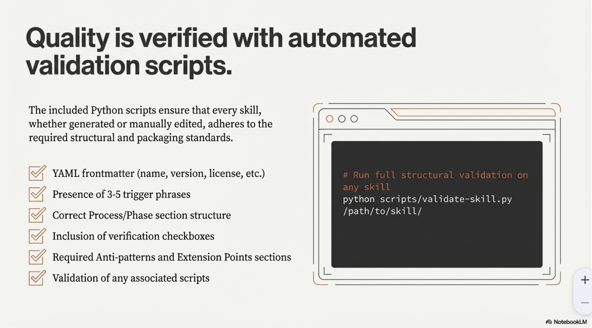

```bash
# Quick validation (required for packaging)
python scripts/quick_validate.py /path/to/skill/

# Full structural validation
python scripts/validate-skill.py /path/to/skill/

# Package for distribution
python scripts/package_skill.py /path/to/skill/ ./dist
```

## Conclusion

SkillCreator is more than a tool—it is a systematic methodology for quality.

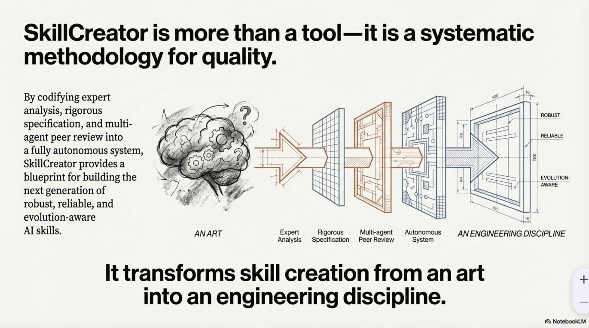

By codifying expert analysis, rigorous specification, and multi-agent peer review into a fully autonomous system, SkillCreator provides a blueprint for building the next generation of robust, reliable, and evolution-aware AI skills.

**It transforms skill creation from an art into an engineering discipline.**

## Requirements

- Claude Code CLI
- Claude Opus 4.5 model access
- Python 3.8+ (for validation scripts)

## License

MIT License - see [LICENSE](LICENSE)
